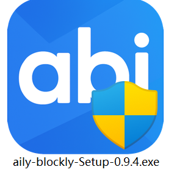
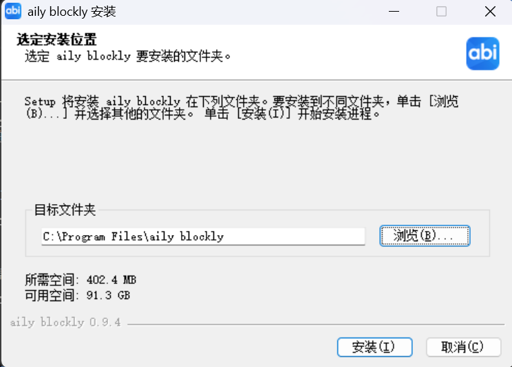
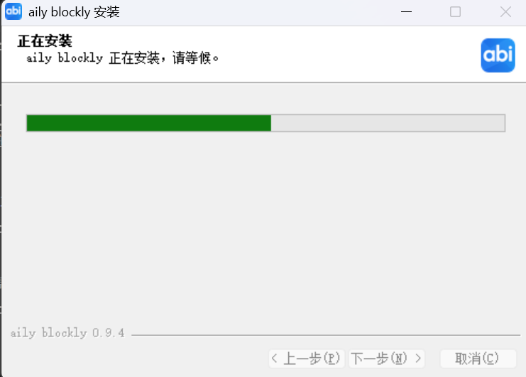
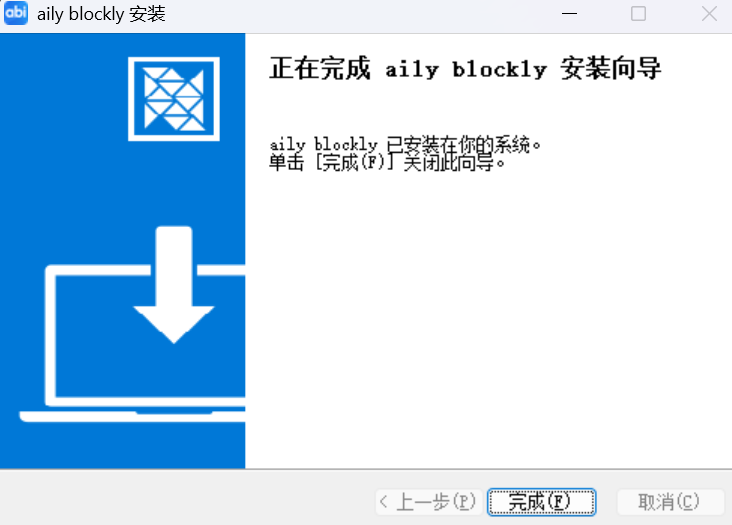
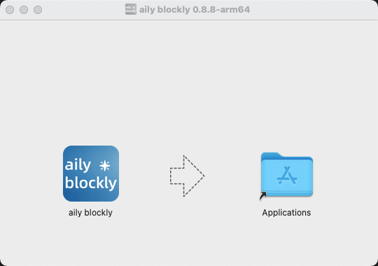
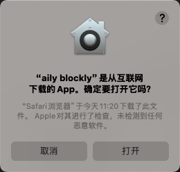
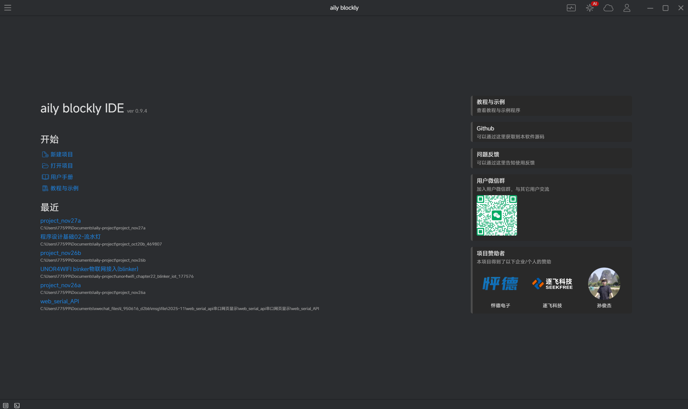

# 软件安装  

## 下载软件
下载地址1：https://aily.pro/download  
下载地址2（Github）：https://github.com/ailyProject/aily-blockly/releases  

## windows安装
从下载链接中下载好当前版本的软件

双击安装程序，可以点击浏览，更改aily-blockly的安装目录

等待安装完成

点击`完成`，结束此次安装

## Mac安装
1. 双击安装程序(如:aily-blockly-0.8.8.dmg)，便会出现安装界面：
  

将`aily blockly`图标拖往`Applications`中  

2. 从`启动台`中便可找到 aily blockly应用  

3. 初次打开会弹出如下确认信息，点击打开即可  

## 运行程序

双击aily blockly图标即可打开软件，片刻之后你会看到主界面  

