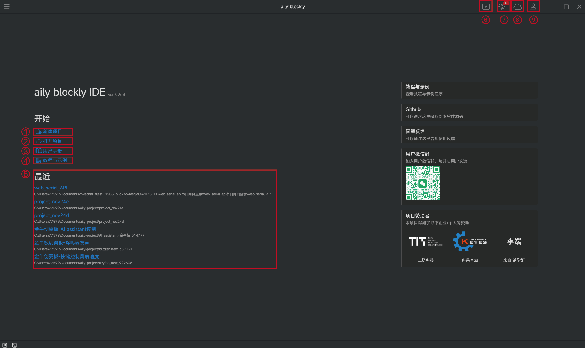

# 主界面功能介绍

①`新建项目`:新建一个项目

②`打开项目`：打开之前保存的项目

③`用户手册`：访问软件官方网站，查看相关指南

④`教程与示例`：查看其他用户通过云空间分享的项目

⑤`最近打开项目 `：快捷打开你最近访问过的项目

⑥`串口工具 `：串口通信工具，串口监视器

⑦`AI工具`：使用AI功能，可使用问答模式与代理（agent）模式

⑧`云空间`：通过云空间保存自己的项目，或分享自己已保存的项目给其他用户

⑨`用户登录`：登录自己的用户账号，可使用AI功能和云空间功能