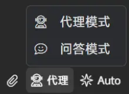

# AI功能使用指南
在主界面右上为工具栏，点击其中的  按钮，即可开始AI交互功能。  


## 模式切换  

点击AI界面下方的模式切换按钮，可以切换AI模式  
   

### 问答模式
问答模式下，AI具备项目可读权限，可以收集工作区信息，给用户提供问题解答


### 代理（agent）模式

代理模式下，AI具备对项目的读写权限，可以进行项目分析、自动编程、错误修复、转换库等多种功能。

#### 项目分析
```

```

#### 自动编程
```

```

#### 错误修复
```

```

#### 转换库
```

```

## AI功能配置  
### 使用外部模型

