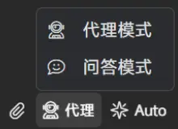

# AI功能使用指南  

在主界面右上为工具栏，点击其中的  按钮，即可开始AI交互功能。  

## 模式切换  

点击AI界面下方的模式切换按钮，可以切换AI模式  
   

`问答模式`下，AI具备项目可读权限，可以收集工作区信息，给用户提供问题解答；  
`代理模式`下，AI具备对项目的读写权限，可调用预设的工具及服务对项目进行操作，但会大量消耗token。

## 常见使用方法

切换到代理模式，可以进行项目分析、自动编程、错误修复、转换库等多种功能。

### 项目分析
你可以尝试输入你的项目需求，可以是模糊的需求：

> 我要开发一个环境数据记录器，帮我设计。

也可以是明确的需求：

> 用ESP32结合DHT22采集温湿度数据，并存储到TF卡上。每60秒采集一次，并以系统时间+数据的形式记录到文件中，格式为“时间戳，温度，湿度\n”，如:"123456,32,45\n"


### 自动编程
直接描述你要的程序，然后等待AI为你编写
> 帮我写一个串口测试程序：使用Arduino UNO R4 minima；115200波特率通信；每500ms输出一组数值；每组8个随机数值，数值间用逗号分隔，单个数值范围在0~255区间内；每组以换行结尾；每组对应位的数值应该具有连续性，不能波动较大。

### 错误修复
当编译、上传报错时，点击查看详情，可以在日志中看到报错内容，然后双击报错内容，可以将错误提交到AI输入框，发送报错信息，AI会给出处理建议，或直接帮您处理。

### 生成库
你只需要提供以下任一给AI，AI即可给你生成一个专用库:
- 器件型号，如 L298N
- markdown格式文档 或 文档网页
- github链接
- 本地源码路径（推荐，可以是arduino库、也可以是其他框架、其他芯片的源码）

提示词如下：
```
"C:\Users\coloz\Downloads\xxx-lib" 是xxx库源码，将这个库转换为aily blockly库
```
然后等待库转换完成，AI会提示你进行安装。

### 复杂任务/长程任务  
当任务较为复杂或底层时，如库管理中。没有提供现成的库支持时，你可以在你的提示词中加入如下语句：
```
如果现有库无法满足该需求，可考虑先生成一个支持库，然后再使用该库进行编程
```
这样，AI会自动尝试把需求拆解成多个库/block，进行编程

## AI功能配置  
通过AI ASSISTANT界面右上角的设置按钮，可以打开AI助手设置页面  
### 使用外部模型  
在设置页面，你可以填入自有LLM apikey，来调用更多模型。主要注意的是：  
- 模型接口需要是openAI接口风格；
- 云端固化有提示词，因此不能接入使用localhost上的模型，如有自部署需求，请将接口转发至公网；（不固化提示词，会导致我们的接口被恶意使用）
- 需要使用700B以上的旗舰模型，才能获得正常的agent效果，测试200B以下模型毫无意义。

### 循环次数
循环次数，是单次agent操作的请求最大次数，最大100次，通常不需要修改。

