# 基本使用方法

## 选择开发板新建项目  
1.点击新建项目

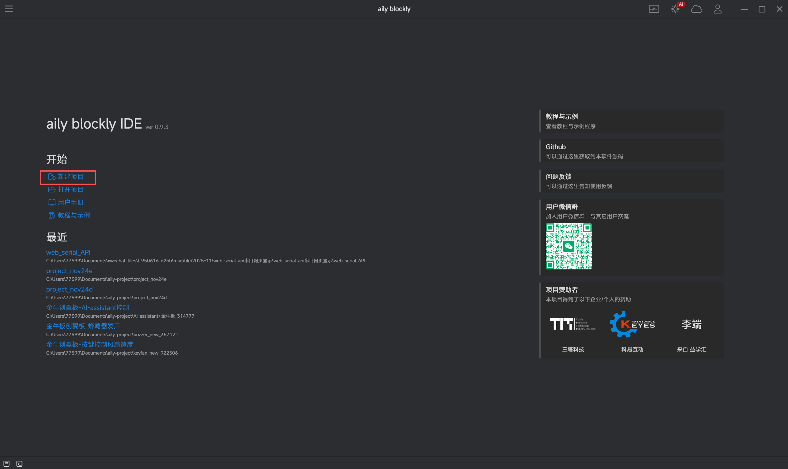

2.选择你需要的开发板

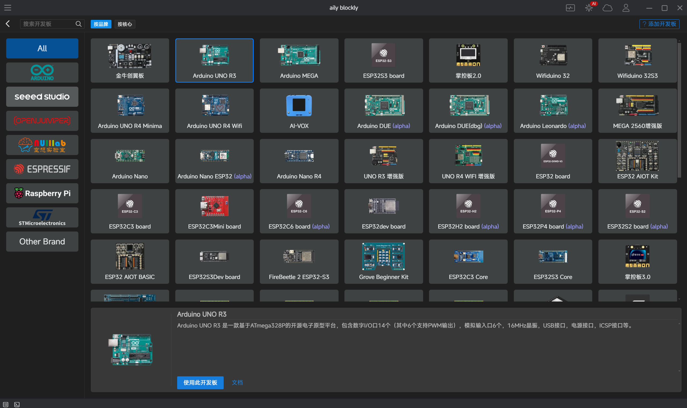

3.选中后点击下方的"使用此开发板"

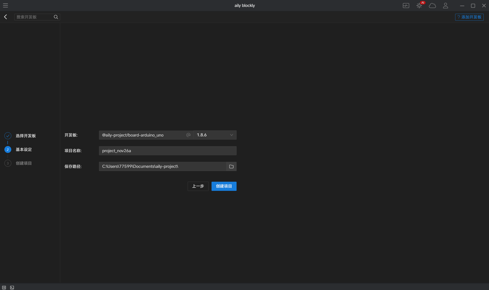

4.点击"创建项目"

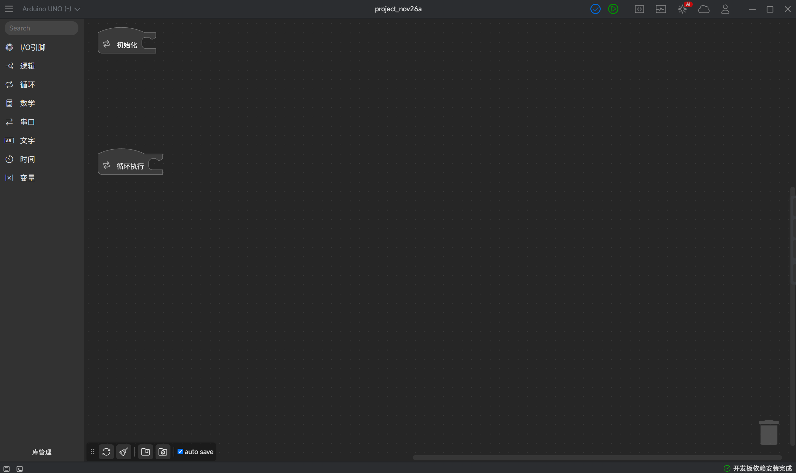

现在，我们已经成功创建了我们所需开发板的项目

## 选择示例程序新建项目
除了选择开发板进行创建之外，我们还可以选择别人上传的示例程序，点击开始栏中的"教程与示例"

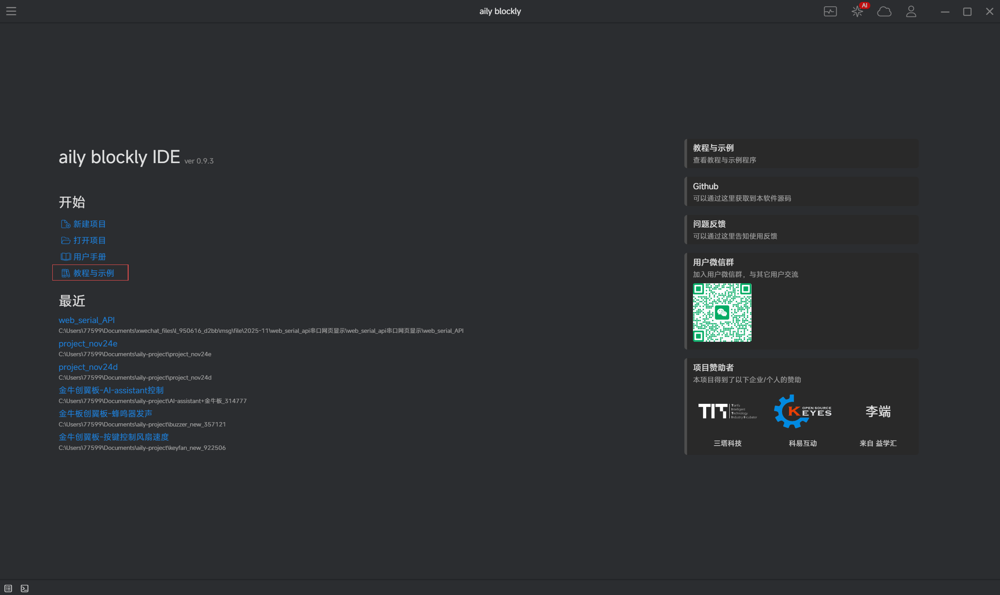

打开教程与示例之后，会看到其他用户上传的示例程序，也可以通过搜索直接找到自己需要的相关示例

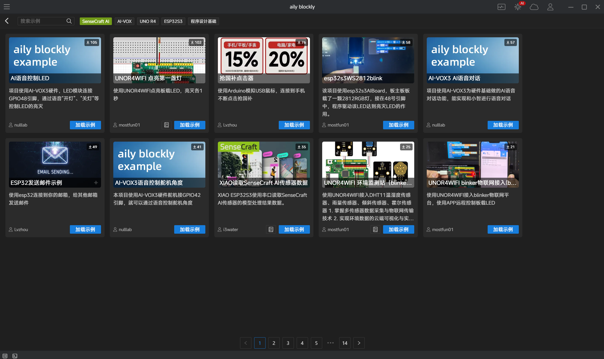

选择好自己需要的示例之后，点击加载示例

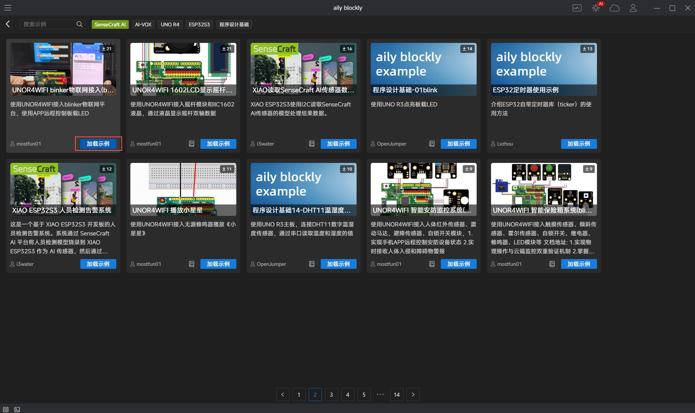

加载完成后，就可以看到示例程序了，同时会自动安装该示例的库文件，之后也可以自行修改示例

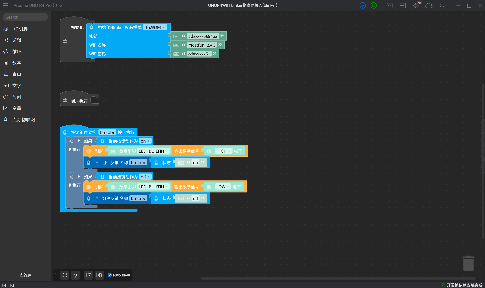

## 安装与使用库

新建项目或加载示例后，可以在左侧模块区域的下方看到"库管理"

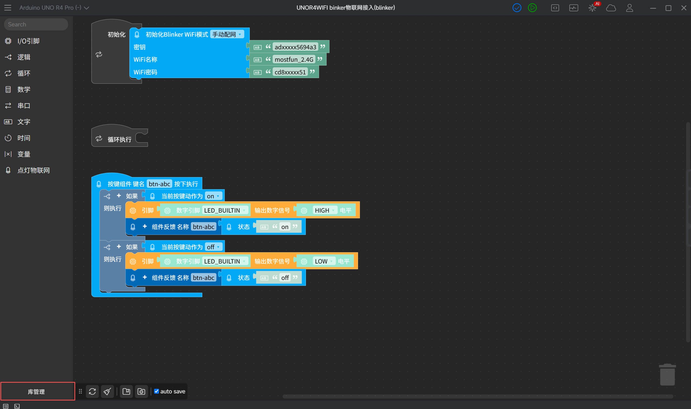

点击"库管理"

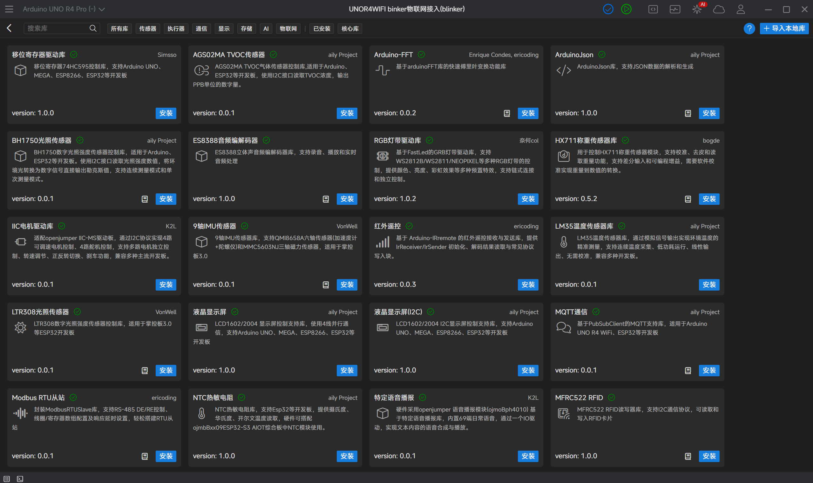

可以在库管理上方的分类中找到自己需要的库，也可以直接搜索自己需要的库的名称或功能，点击安装。

这里我们搜索DHT11温湿度传感器的库，点击安装，等待几秒后会提示已安装成功

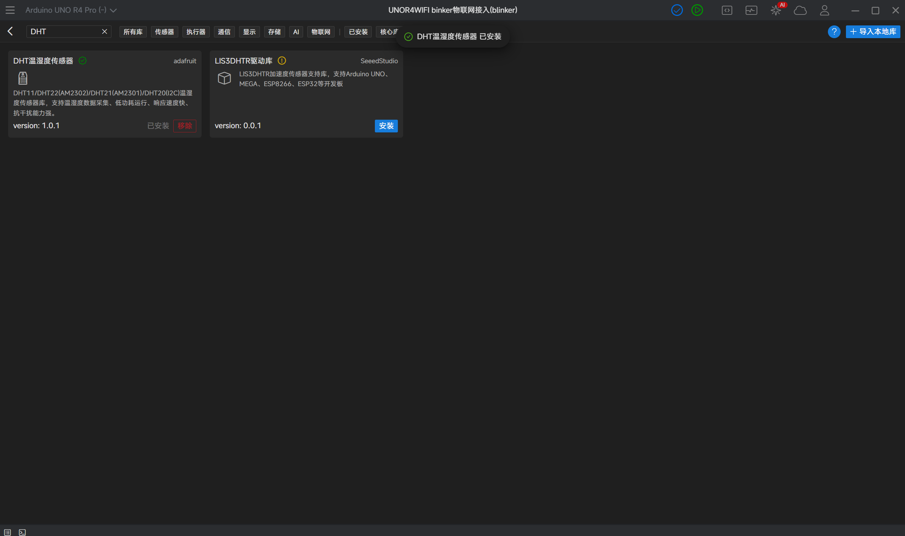

## 移除已安装库

对于已经安装的库文件，我们还是点击进入库管理，在已安装的栏目下可以找到已经安装的库文件，点击移除，就可以移除掉之前安装的库

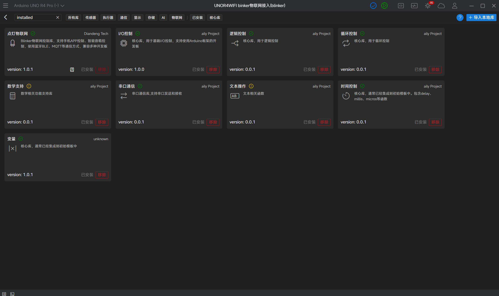

