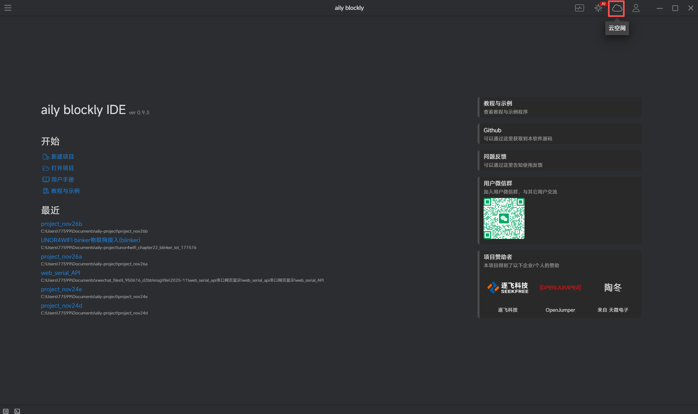
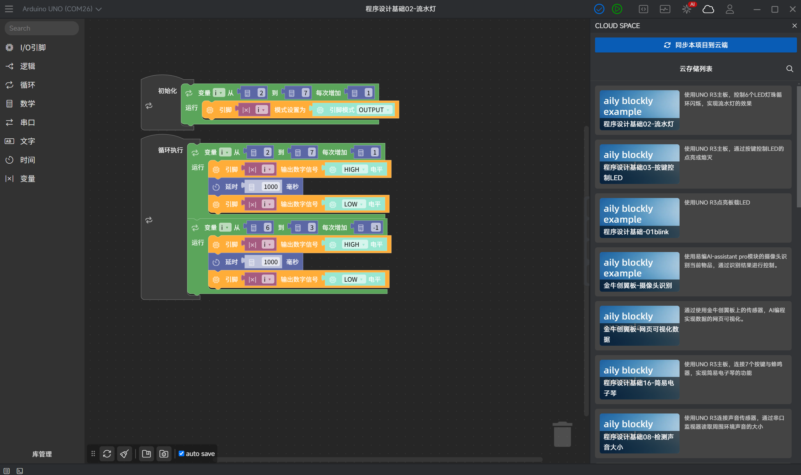
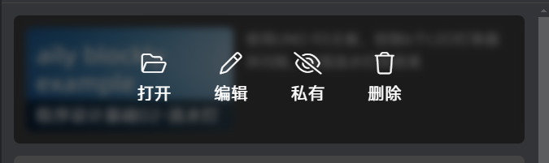
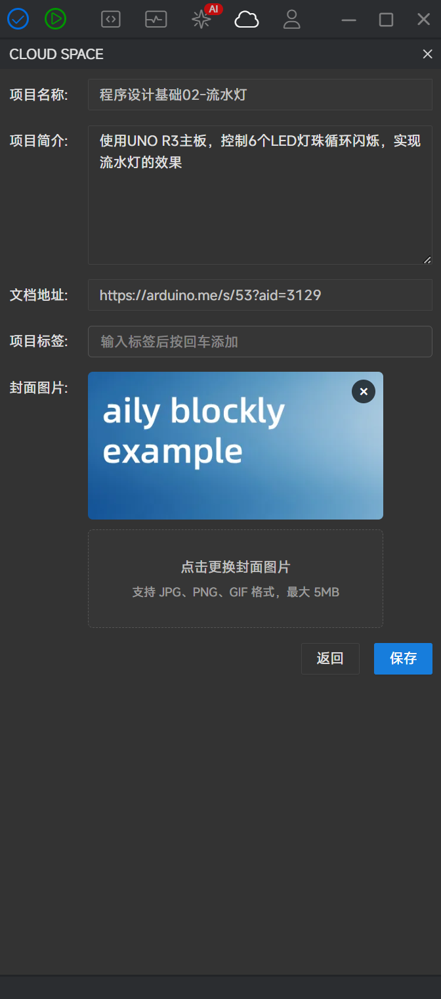
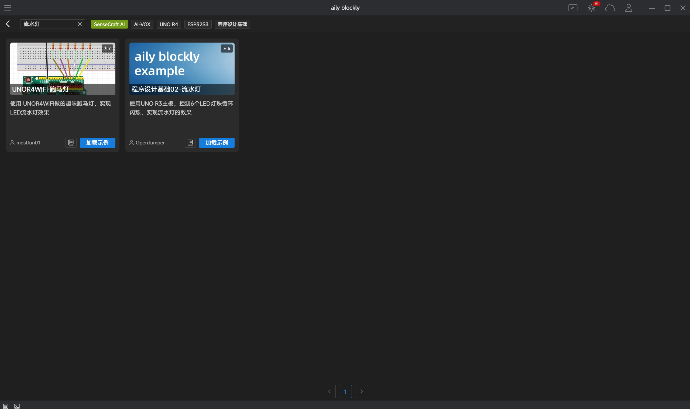

# 云存储与项目分享

## 云存储功能使用

登录账号之后，可以通过云存储功能将项目存储至云端，更换电脑后，也可以直接从云端加载至本地

点击`云空间`打开自己的云存储

<<<<<<< HEAD

=======

>>>>>>> 8c9bb3d8e6850b7d99400fa71ee82d33c255322b

在主界面打开，会显示之前已同步的项目

在自己的项目页面打开，则会出现`同步本项目到云端`的选项

<<<<<<< HEAD

=======

>>>>>>> 8c9bb3d8e6850b7d99400fa71ee82d33c255322b

点击`同步本项目到云端`就可以将项目存储在云端

## 项目分享

存储在云端的项目，同样可以分享给别人

存储之后将鼠标移动到项目上，可以看到有四个选项

`打开` `编辑` `私有/公开` `删除`

<<<<<<< HEAD

=======

>>>>>>> 8c9bb3d8e6850b7d99400fa71ee82d33c255322b

打开：打开此云端项目

编辑：对项目的封面/介绍/项目名称等进行编辑

<<<<<<< HEAD

私有/公开：选择是否将自己的项目公开到`教程与示例`中与别人分享，如果选择公开，就可以在`教程与示例`中找到自己公开的项目

=======

私有/公开：选择是否将自己的项目公开到`教程与示例`中与别人分享，如果选择公开，就可以在`教程与示例`中找到自己公开的项目

>>>>>>> 8c9bb3d8e6850b7d99400fa71ee82d33c255322b

删除：删除此云端项目

