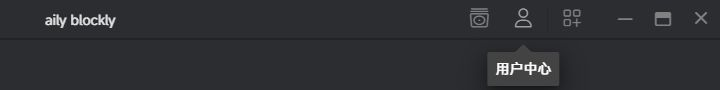
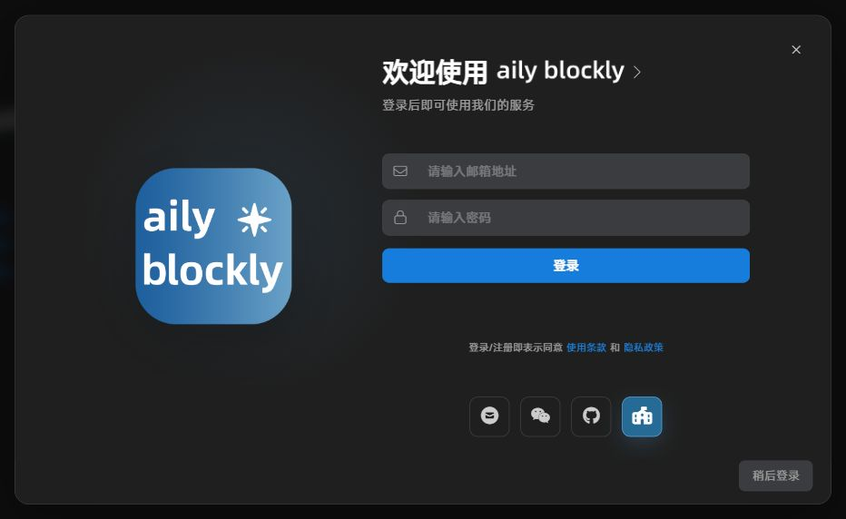

# 教育版使用指南

申请人使用个人账号申请教育版；学生使用教师或账号负责人分发的教育版账号和密码登录 aily blockly。

## 申请教育版

### 1. 进入申请页面

使用个人账号登录[管理台](https://c.yiyu.pro)，进入**个人用户中心 → 我的订阅**，点击**申请教育版**。

### 2. 填写申请信息

按页面提示填写姓名、手机号，选择申请类型和学校或机构所在地，并填写学校官方全称或机构营业执照名称。

### 3. 上传认证材料

根据申请页面所选类型，准备并上传对应材料：

| 申请类型 | 所需材料 |
| --- | --- |
| 学校教师 | 教师资格证、本人身份证 |
| 培训机构 | 加盖机构公章的营业执照复印件、盖章任职证明 |

任职证明可使用申请页面提供的 Word 模板，填写并盖章后上传 PDF 或图片。

两项材料均须上传，每项至少一个文件，并确保内容清晰；盖章材料需确保公章清晰可见。支持 PDF、PNG、JPEG 格式，两项合计最多 10 个文件，单个文件不超过 5 MB，总大小不超过 15 MB。

### 4. 提交并查看审核结果

阅读《aily blockly 教育版权限申请及使用协议》，勾选**我已阅读并同意**，点击**申请教育版**提交申请。

提交后可在申请页面查看审核状态。若审核未通过，根据页面显示的审核意见修改信息或材料后重新提交。

开通后，由申请人向学生分发教育版账号和密码。

## 登录教育版账号

### 1. 领取账号和密码

向授课教师或账号负责人领取教育版账号和密码。账号采用邮箱形式，请保留完整账号（包括 `@` 及后面的内容），无需自行注册。

### 2. 打开登录窗口

打开 aily blockly，点击顶部工具栏的**用户中心**人形图标。未登录时会打开登录窗口；如果启动软件时已显示登录窗口，可直接进行下一步。

### 3. 选择 EDU 登录并输入账号

点击登录窗口底部的**学校旗帜图标**，鼠标悬停时会显示 **EDU 登录**。

在“请输入邮箱地址”中输入领取的完整教育版账号，在“请输入密码”中输入对应密码，然后点击**登录**。教育版账号使用密码登录，无需获取邮箱验证码。

### 4. 遇到登录问题

如果忘记密码或无法登录，请联系授课教师或账号负责人。
