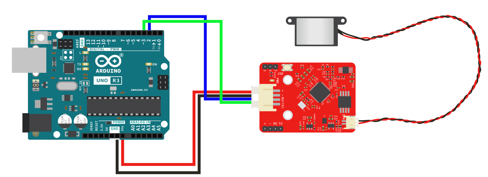
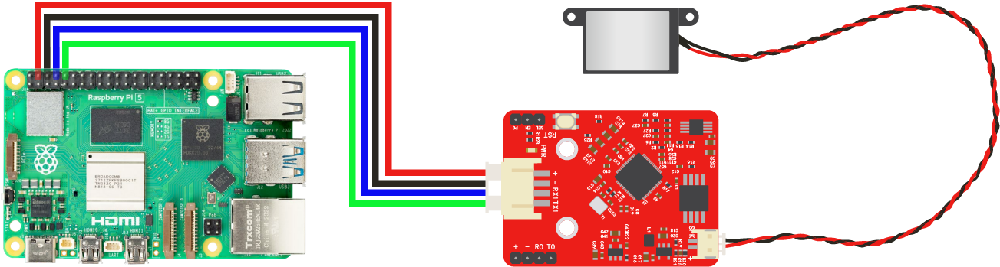

# aily TTS module使用手册
|  |  |  |
| ------------------------------------------------------------ | ------------------------------------------------------------ | ------------------------------------------------------------ |


## 概述

本模块可使用语音合成（Text To Speech，TTS）技术将文本转化为声音。

模块使用需搭配上位机设备和扬声器，可以在无网络状态下，通过串口协议，将UTF8编码的文本转换成语音播报。

可应用于叫号系统、考勤机、玩具、地图导航、智能家居等场景，是一套极具性价比的语音合成方案。

本模块具有如下功能及优势：

**文本合成功能**：支持任意中文汉字（不支持繁体字，生僻字）文本合成，英文按单个字母发音。文本编码支持GB2312，单次合成文本量不超过4K字节；

**文本分析功能**：智能解析常见标点符号，常见多音字、数字。支持常用英文单位（需小写）、特殊数字发音。单句无停顿标点符号句子长度超过50字将自动切断；

**高音质语音输出**：模块支持高品质的语音输出，能够提供清晰的声音、和自然的语音播放效果；

**多语言支持**:  模块支持中文和英文内容混合播报，满足现代化的使用场景；

**高实时性**: 可以实时将文本转换为语音，相较于云端语音合成更快，不受网络环境影响，也无持续费用产生。

## 相关参数

+ 工作电压：5V
+ 通信电平：3.3V
+ 工作温度：-40℃~85℃

**物理特性**

+ 通讯串口连接方式：PH2.0*4P
+ 固件下载串口：XH2.54*4P
+ 喇叭接口MX1.25*2P
+ 驱动的喇叭参数：1W/8Ω（推荐使用）
+ 模块尺寸：4.4cm*3.2cm
+ 固定孔：标准乐高孔
+ 固定孔中心间距：16mm
+ PWR：电源指示灯
+ RST：复位按键

**通信**

+ 控制方式：串口通信
+ 通信波特率：115200


## 语音合成

本模块需配合上位机使用，上位机可为各类单片机、各类Linux单板机、Arduino、树莓派、PC、Mac等带有串口功能的设备。参考本文档播报协议，上位机向本模块发送对应播报指令，即可让模块合成并播放语音。

### 播报协议

本模块可接收的串口指令由以下几部分构成：

| 帧头 | 数据长度 | 命令参数 | 编码参数 | 播报文本                                                     |
| ---- | -------- | -------- | -------- | ------------------------------------------------------------ |
| FD   | 00 17    | 01       | 04       | E4 BD A0 E5 A5 BD EF BC 8C E6 88 91 E6 98 AF E8 89 BE E8 8E 89 |

其中 `帧头`、`命令参数`、`编码参数` 是固定的，通常不用修改。

`数据长度`为`播报文本`的UTF8编码长度+2（命令参数和编码参数占用了两个字节）

以上示例中，播报内容为“你好，我是艾莉”，对应的指令为：

```
FD 00 17 01 04 E4 BD A0 E5 A5 BD EF BC 8C E6 88 91 E6 98 AF E8 89 BE E8 8E 89
```

将指令以115200波特率向本模块发送，模块即可合成并播放对应语音。


### 多音字标注

[=*] 标记前一汉字的拼音

例：空调[=tiao2]调[=tiao2]到三十度

汉字拼音解析为：kong1 tiao2 tiao2 dao4 san1 shi2 du4

其中，拼音格式为拼音+声调，声调数值范围1-5，分别代表（1:阴平 2:阳平 3:上声 4:去声 5:轻声）。拼音中ü用字母v代替，字母均为小写。

### 数字标注

[n\*]，指定该标记后的数字发音方式，*为1时按数字发音，*为2时按数值发音，*为3时按电话号码格式发音。该标记后必须跟数字才能有效转换。

例：共消费[n2]100元，请拨打电话[n1]95511，手机号码[n3]18812341121。

解析为：共消费一百元，请拨打电话九五五一一，手机号码幺八八幺二三四幺幺二幺。

### 英文标注

[h1]标记前一组英文字符，将以英文字母形式播放内容

例：aily project是我们推出的AI[h1]硬件项目，致力于提供多种AI[h1]能力模块，帮助用户快速开发出AI[h1]时代的原生硬件

其中，aily project将生成对应的单词读音，而标注的"AI"将逐个单读字母。

### 停顿标注

[w0]，指定该位置做短暂停顿。

例：请[w0]赵先生[w0]到213诊室就诊


## 可用指令

### 功能指令

| 功能     | 指令        | 说明                                           |
| -------- | ----------- | ---------------------------------------------- |
| 停止播放 | FD 00 01 02 | 停止正在播放的内容                             |
| 暂停播放 | FD 00 01 03 | 暂停正在播放的内容，可通过继续播放指令恢复播放 |
| 继续播放 | FD 00 01 04 | 恢复已暂停播放的内容                           |


### 状态获取

| 功能     | 指令        | 说明               |
| -------- | ----------- | ------------------ |
| 获取状态 | FD 00 01 21 | 获取当前模块状态，反馈的状态有：<br>4A初始化完成<br/>4E正在合成播放<br/>4F等待合成播放 |


### 调节指令

| 调节内容 | 指令                            | 说明                                                         |
| -------- | ------------------------------- | ------------------------------------------------------------ |
| 音量调节 | FD 00 06 01 04 5B 76 (30-39) 5D | 支持10级音量调节，发送协议头+[v0]-[v9]，音量由小到大。默认为5。 |
| 语速调节 | FD 00 06 01 04 5B 73 (30-39) 5D | 支持10级语速调节，发送协议头+[s0]-[s9]，语速由快到满，默认为5。 |
| 语调调节 | FD 00 06 01 04 5B 74 (30-39) 5D | 支持10级语调调节，发送协议头+[t0]-[t9]，语调由低到高，默认为5。 |


## 发音人

模块默认支持女声发音，客户如有大批量生产需求，我司可提供音色定制服务。


## 上位机开发

为方便用户开发上位机端程序，aily Project提供了配套测试软件，使用chrome、edge等现代浏览器访问以下地址，即可使用软件。

软件使用地址：https://software.aily.pro/tts

### PC端测试

#### 使用方法

1. 通过USB转串口模块连接TTS模块至PC


2. 使用chrome或edge浏览器打开测试软件，软件地址：https://software.aily.pro/tts
3. 点击软件右上角按钮，并在弹出框中选择对应的设备串口
4. 点击任意测试语句或输入自定义语句，再点击即可让TTS模块合并并播放对应语音

#### 指令和代码生成

软件中生成的指令可以直接用于上位机串口发送，也可以使用软件右侧生成的代码。

两者的区别是，指令一般用于固定语句，使用代码可以更灵活的播放各种语句。

使用代码需要注意的是，**本模块需要使用UTF8编码的中文字符**，如果您使用的代码编辑器默认是GB2132编码（如中文windows环境下使用Visual Studio），请修改为UTF8编码，再使用。

### Arduino开发

#### 硬件连接



>注意事项：
>部分arduino开发板0、1所在的串口同时用于和电脑通信，如若没有多的串口，那推荐使用软串口连接TTS模块。


#### 示例代码

直接修改变量ttsString中的文本，即可测试合成效果。

程序中genTTSBuffer函数用于生成指令，sendTTSBuffer函数用于发送生成的指令。

```c++
#include <Arduino.h>
  // 使用软串口通信 
  // #include <SoftwareSerial.h>
  // SoftwareSerial mySerial(2, 3);
  const char* ttsString = "你好，我是艾莉";
  
  void setup() {
    // 初始化串口通信
    Serial.begin(115200);
    // 使用软串口通信
    // mySerial.begin(115200);
  }
  
  void loop() {
    // 调用生成缓冲区函数
    uint8_t* buffer = genTTSBuffer(ttsString);
    // 发送缓冲区数据
    sendTTSBuffer(buffer);
    // 释放缓冲区内存
    free(buffer);
    // 暂停一段时间
    delay(1000);
  }
  
  void sendTTSBuffer(uint8_t* buffer) {
    // 计算缓冲区的实际长度
    int length = (buffer[1] << 8) | buffer[2];
    for (int i = 0; i < length + 3; i++) {
      Serial.write(buffer[i]);
      // 使用软串口通信
      // mySerial.write(buffer[i]);
    }
  }
  
  uint8_t* genTTSBuffer(const char* content) {
    uint8_t buffer_head[] = {0xFD};
    uint8_t buffer_cmd[] = {0x01};
    uint8_t buffer_encode[] = {0x04};
  
    int content_length = strlen(content);
    int buffer_text_length = content_length + 2;
    uint8_t highByte = buffer_text_length >> 8;
    uint8_t lowByte = buffer_text_length & 0xFF;
    uint8_t buffer_length[] = {highByte, lowByte};
  
    uint8_t* buffer = (uint8_t*)malloc(3 + content_length + 3);
    int index = 0;
    buffer[index++] = buffer_head[0];
    buffer[index++] = buffer_length[0];
    buffer[index++] = buffer_length[1];
    buffer[index++] = buffer_cmd[0];
    buffer[index++] = buffer_encode[0];
    for (int i = 0; i < content_length; i++) {
      buffer[index++] = content[i];
    }
    return buffer;
  }
```


### 树莓派/Linux设备开发/Windows/Mac OS


#### 硬件连接

请根据项目实际情况，选择一种连接方式：

a. 通过硬件串口连接

此处以树莓派为示例，模块连接到树莓派UART0（14、15引脚）



b. 通过USB转串口模块连接


> 注意事项：
> 在windows设备中串口为COM+数字编号形式，如COM3；
>
> 在Linux设备中USB串口为/dev/ttyUSB+数字编号，如/dev/ttyUSB0；
>
> 在树莓派上可以使用14、15引脚的UART0，其在系统中的通常为/dev/ttyAMA0

#### 示例代码

直接修改变量ttsString中的文本，即可测试合成效果。

程序中genTTSBuffer函数用于生成指令，sendTTSBuffer函数用于发送生成的指令。

##### python示例程序

```python
# 需单独安装serial包
# pip install serial
import serial
  
  # 串口配置
  ser = serial.Serial('/dev/ttyUSB0', 115200)
  
  ttsString = "你好，我是艾莉"
  
  def genTTSBuffer(content):
      buffer_head = [0xFD]
      buffer_cmd = [0x01]
      buffer_encode = [0x04]
  
      content_bytes = content.encode('utf-8')
      content_length = len(content_bytes)
      buffer_text_length = content_length + 2
      highByte = buffer_text_length >> 8
      lowByte = buffer_text_length & 0xFF
      buffer_length = [highByte, lowByte]
  
      buffer = bytearray(buffer_head + buffer_length + buffer_cmd + buffer_encode + list(content_bytes))
      return buffer
  
  def sendTTSBuffer(buffer):
      ser.write(buffer)
      print('Message written')
  
  # 初始化串口通信
  if ser.is_open:
      print('Serial Port Opened')
      buffer = genTTSBuffer(ttsString)
      sendTTSBuffer(buffer)
```

##### nodejs示例程序  

```javascript
// 需单独安装serialport包
// npm install serialport
const SerialPort = require('serialport');

  const port = new SerialPort('/dev/ttyUSB0', {
    baudRate: 115200
  });
  
  const ttsString = "你好，我是艾莉";
  
  // 初始化串口通信
  port.on('open', () => {
    console.log('Serial Port Opened');
    sendTTSBuffer(genTTSBuffer(ttsString));
    setInterval(() => {
      sendTTSBuffer(genTTSBuffer(ttsString));
    }, 1000);
  });
  
  // 生成TTS缓冲区
  genTTSBuffer(content) {
    let buffer_head = new Uint8Array([0xFD]);
    let buffer_cmd = new Uint8Array([0x01]);
    let buffer_encode = new Uint8Array([0x04]);
    let buffer_text = new TextEncoder().encode(content);

    let buffer_text_length = buffer_text.length + 2;
    let highByte = buffer_text_length >> 8;
    let lowByte = buffer_text_length & 0xFF;
    let buffer_length = new Uint8Array([highByte, lowByte]);

    let buffer = Uint8Array.from([...buffer_head, ...buffer_length, ...buffer_cmd, ...buffer_encode, ...buffer_text]);
    return buffer;
```


