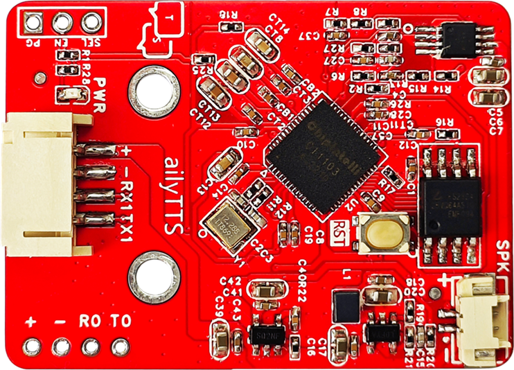
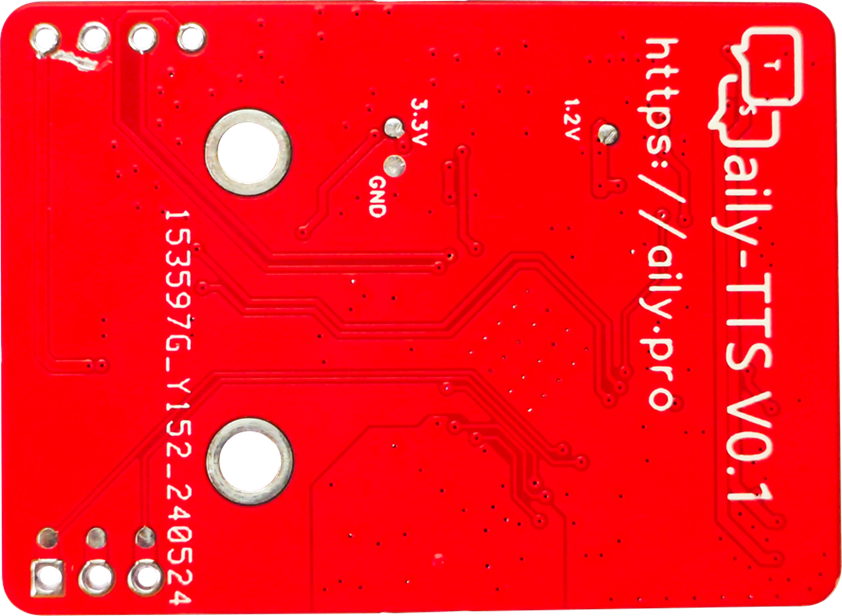
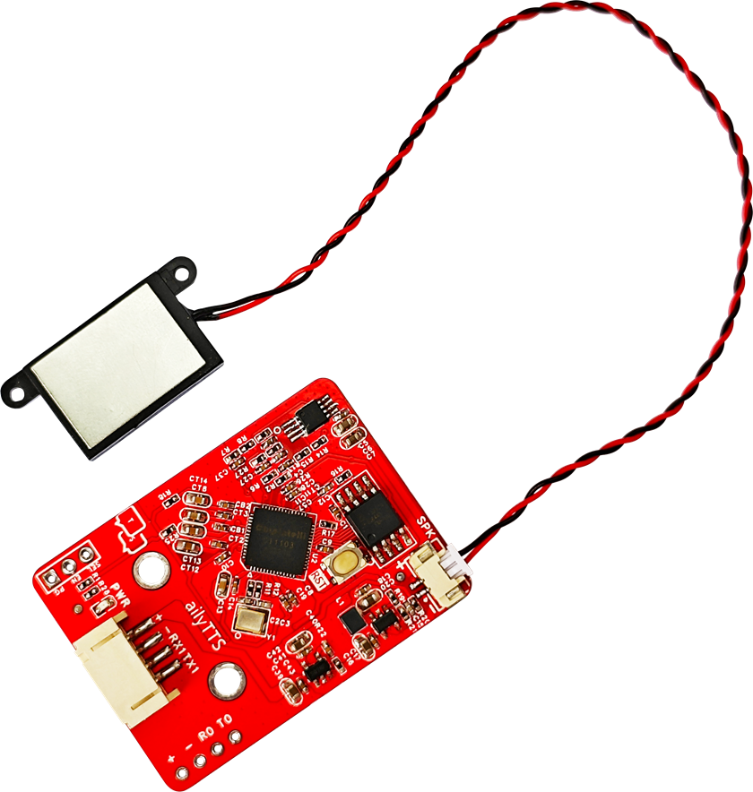
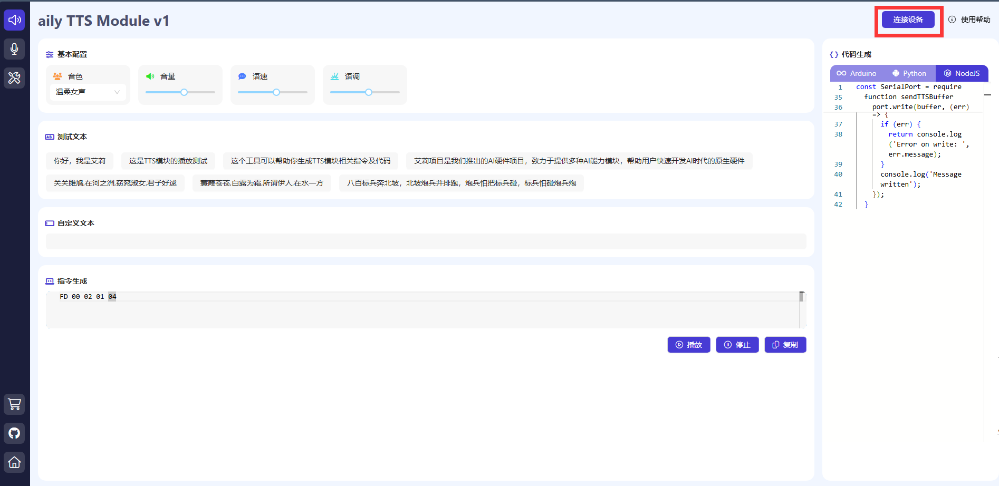
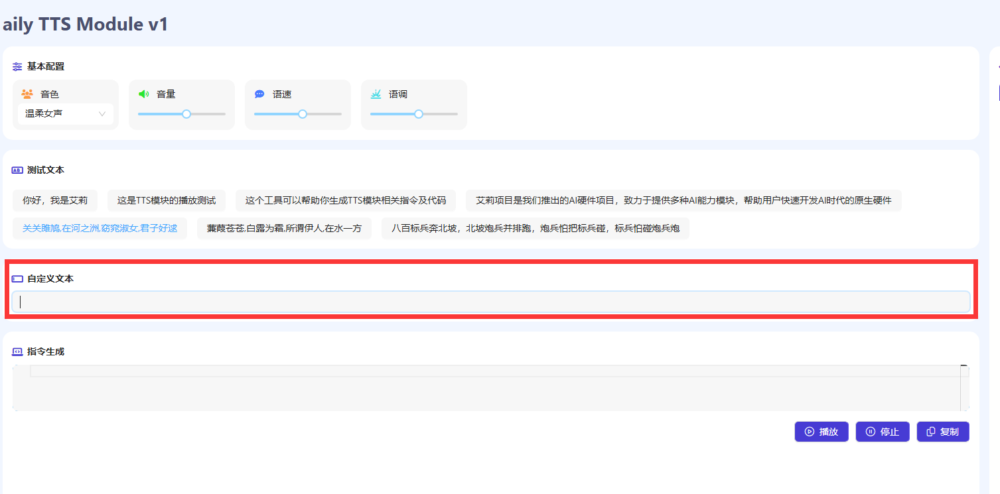
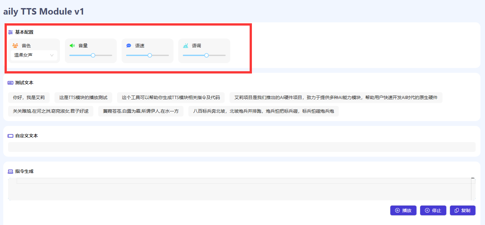
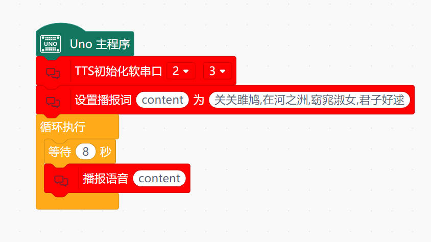

# aily TTS module(TTS语音模块)  

## 硬件特性

TTS (Text-to-Speech, 文本转语音)语音播报模块是一种通过计算机程序将文本转换为语音的技术。这种技术可以用于语音合成、语音提示、自动化对话和其他自然语言处理任务。该模块采用启英泰伦的CI1103芯片。广泛应用于智能语音助手、智能音箱、车载语音导航等领域。
<table border="1">

<tr>
  <td align="center"></td>
  <td align="center"></td>
  <td align="center"></td>
</tr>
<tr>
  <td style="background-color:rgb(232,232,232,0.5) "colspan="3" align="center"> <a href="https://item.taobao.com/item.htm?id=805475331459"><font style="font-size:16px"> TTS语音模块 </font></a> </td>
</tr>
</table>

+ 音频输出接口：TTS语音模块结合软件aily TTS Module v1，将自定义文本生成语音，通过模块外接喇叭输出播放出来。

+ 音频控制：该模块具有音色选择，音量控制、语调调节和语速调节等功能，以便用户可以根据自己的需求进行调整。

+ 连接接口：TTS语音模块需要与计算机进行连接，以便接收文本输入并输出相应的语音。

### 特点:
+ 高音质语音输出：模块支持高音质的语音输出，能够提供清晰、自然的语音播放效果。

+ 自然度高: 可以生成自然流畅的语音，使得听者能够更加轻松地理解文本内容。

+ 多语言支持: 支持多种语言，可以根据需要进行选择。

+ 实时性强: 可以实时将文本转换为语音,使得用户能够立即听到需要的信息。

### 优点:

1.提升用户体验:将文本转换为语音可以提升用户的使用体验，减少用户的阅读负担。

2.提高效率: TTS语音播报模块可以快速地将大量的文本转换为语音,提高工作效率。

3.降低成本:使用TTS语音播报模块可以节省人力、物力和时间成本,特别是在需要进行大量语音提示或对话的场合。


## 技术参数

+ 电源电压：5V

+ 串口电平：3.3V

+ 单次转换长度：4K字节

+ 工作温度：-40℃~85℃

+ 通讯串口连接方式：PH2.0*4P

+ 固件下载串口：XH2.54*4P

+ 喇叭接口MX1.25*2P

+ 驱动的喇叭参数：1W/8Ω（推荐使用）

+ 模块尺寸：4.4cm*3.2cm

+ 固定孔：标准乐高孔

+ 固定孔中心间距：16mm（两个乐高单位）

+ PWR：电源指示灯

+ RST：复位按键

**存储**

+ 支持QSPI Nor Flash

+ 内置512KB SRAM

+ 内置DRAM

**音频**

+ 内置高性能低功耗Audio Codec，支持两路ADC 采样和单路 DAC 播放

+ 16kHz/24kHz/32kHz/44.1KHz/48KHz等采样率


## 使用方法 

### 连线示意图


### 软件功能测试 

首先在浏览器中打开TTS模块配备的网站:<https://software.aily.pro/tts>

将模块连接好后，点击连接设备




文本输入：将要转换为语音的文本输入到aily TTS Module v1软件的自定义文本中。这可以通过直接输入文本（从文件中读取文本或通过网络接口传输文本等方式实现。）




语音输出：生成的语音可以通过音频输出接口播放出来，例如扬声器或耳机。用户可以通过调整音量、音调和语速等参数来调整语音输出的效果。



### arduino驱动TTS示例

连线示意图


#### 标注符播报
```C
/*
【支持十级音量调节】
发送协议头+[v0]，设置音量为最小；
发送协议头+[v9]，设置音量为最大；
默认为中等音量。
【支持十级语速调节】
发送协议头+[s0]，设置语速为最慢。
发送协议头+[s9]，设置语速为最快；
默认为正常的语速。
【支持十级语调调节】
发送协议头+[t0]，设置语调为最低。
发送协议头+[t9]，设置语调为最高；
默认为正常的语调。
【多音字标记】
空调[=tiao2]调[=tiao2]到三十度。
负载[=zai3]较高的问题[=ti5]就解决了。
多音字标记对前一汉字读音进行标记，拼音格式为[=wei2]拼音+声调，声调数值范围1-5，分别代表（1:阴平，2:阳平，3:上声，4:去声，5:轻声）
【数字标记】
一共消费[n2]1000元，如有疑问请拨打号码[n1]95543，或[n3]18812341735。
【停顿标记】
今天[w0]是美好的一天。
创客坊[w0]对于测试工作[w0]列出了三个要点。
*/


#include <Arduino.h>
#include <SoftwareSerial.h>
SoftwareSerial mySerial(2, 3);


const char* ttsString = "各位乘客[w0]，欢迎乘坐本次列车。请务必注意安全[w0]，避免摔倒。空调[=tiao2]调[=tiao2]到合适温度[w0]，让您旅途舒适。单程车票价格为[n2]1000元,如果有疑问，请拨打号码[n1]95543,或[n3]18812341735。本次列车[w0]严禁吸烟[w0]请保持环境卫生。";
  

void ReadingTextAloud(const char* ttsString){
  size_t bufferLength;
  uint8_t buffer[256];

  genTTSBuffer(ttsString, buffer, &bufferLength);

  for (size_t i = 0; i < bufferLength; i++) {
   mySerial.write(buffer[i]);
  }
}

void setup() {
	mySerial.begin(115200);
}
void loop() {
	delay(8000);
	ReadingTextAloud(ttsString);
}


void concatByteArrays(uint8_t* result, uint8_t** arrays, size_t* lengths, size_t numArrays) {
  size_t offset = 0;
  for (size_t i = 0; i < numArrays; i++) {
    memcpy(result + offset, arrays[i], lengths[i]);
    offset += lengths[i];
  }
}
  
void genTTSBuffer(const char* content, uint8_t* buffer, size_t* bufferLength) {
  uint8_t buffer_head[] = {0xFD};
  uint8_t buffer_cmd[] = {0x01};
  uint8_t buffer_encode[] = {0x04};

  size_t textLength = strlen(content);
  size_t buffer_text_length = textLength + 2;
  uint8_t highByte = buffer_text_length >> 8;
  uint8_t lowByte = buffer_text_length & 0xFF;
  uint8_t buffer_length[] = {highByte, lowByte};

  uint8_t* buffer_text = (uint8_t*)content;

  size_t lengths[] = {sizeof(buffer_head), sizeof(buffer_length), sizeof(buffer_cmd), sizeof(buffer_encode), textLength};
  uint8_t* arrays[] = {buffer_head, buffer_length, buffer_cmd, buffer_encode, buffer_text};

  *bufferLength = sizeof(buffer_head) + sizeof(buffer_length) + sizeof(buffer_cmd) + sizeof(buffer_encode) + textLength;
  concatByteArrays(buffer, arrays, lengths, 5);
}


void sendTTSBuffer(uint8_t* buffer) {
  // 计算缓冲区的实际长度
  int length = (buffer[1] << 8) | buffer[2];
  for (int i = 0; i < length + 3; i++) {
    Serial.write(buffer[i]);
  }
}

uint8_t* genTTSBuffer(const char* content) {
  uint8_t buffer_head[] = {0xFD};
  uint8_t buffer_cmd[] = {0x01};
  uint8_t buffer_encode[] = {0x04};

  int content_length = strlen(content);
  int buffer_text_length = content_length + 2;
  uint8_t highByte = buffer_text_length >> 8;
  uint8_t lowByte = buffer_text_length & 0xFF;
  uint8_t buffer_length[] = {highByte, lowByte};

  uint8_t* buffer = (uint8_t*)malloc(3 + content_length + 3);
  int index = 0;
  buffer[index++] = buffer_head[0];
  buffer[index++] = buffer_length[0];
  buffer[index++] = buffer_length[1];
  buffer[index++] = buffer_cmd[0];
  buffer[index++] = buffer_encode[0];
  for (int i = 0; i < content_length; i++) {
    buffer[index++] = content[i];
  }
  return buffer;
}
```

#### 英文播报

```C
#include <Arduino.h>
#include <SoftwareSerial.h>
SoftwareSerial mySerial(2, 3);

const char* ttsString = "Artificial Intelligence (AI) has revolutionized the field of broadcasting, making it more efficient and dynamic.";
  

void ReadingTextAloud(const char* ttsString){
  size_t bufferLength;
  uint8_t buffer[256];

  genTTSBuffer(ttsString, buffer, &bufferLength);

  for (size_t i = 0; i < bufferLength; i++) {
   mySerial.write(buffer[i]);
  }
}

void setup() {
	mySerial.begin(115200);
}
void loop() {
	delay(8000);
	ReadingTextAloud(ttsString);
}


void concatByteArrays(uint8_t* result, uint8_t** arrays, size_t* lengths, size_t numArrays) {
  size_t offset = 0;
  for (size_t i = 0; i < numArrays; i++) {
    memcpy(result + offset, arrays[i], lengths[i]);
    offset += lengths[i];
  }
}
  
void genTTSBuffer(const char* content, uint8_t* buffer, size_t* bufferLength) {
  uint8_t buffer_head[] = {0xFD};
  uint8_t buffer_cmd[] = {0x01};
  uint8_t buffer_encode[] = {0x04};

  size_t textLength = strlen(content);
  size_t buffer_text_length = textLength + 2;
  uint8_t highByte = buffer_text_length >> 8;
  uint8_t lowByte = buffer_text_length & 0xFF;
  uint8_t buffer_length[] = {highByte, lowByte};

  uint8_t* buffer_text = (uint8_t*)content;

  size_t lengths[] = {sizeof(buffer_head), sizeof(buffer_length), sizeof(buffer_cmd), sizeof(buffer_encode), textLength};
  uint8_t* arrays[] = {buffer_head, buffer_length, buffer_cmd, buffer_encode, buffer_text};

  *bufferLength = sizeof(buffer_head) + sizeof(buffer_length) + sizeof(buffer_cmd) + sizeof(buffer_encode) + textLength;
  concatByteArrays(buffer, arrays, lengths, 5);
}


void sendTTSBuffer(uint8_t* buffer) {
  // 计算缓冲区的实际长度
  int length = (buffer[1] << 8) | buffer[2];
  for (int i = 0; i < length + 3; i++) {
    Serial.write(buffer[i]);
  }
}

uint8_t* genTTSBuffer(const char* content) {
  uint8_t buffer_head[] = {0xFD};
  uint8_t buffer_cmd[] = {0x01};
  uint8_t buffer_encode[] = {0x04};

  int content_length = strlen(content);
  int buffer_text_length = content_length + 2;
  uint8_t highByte = buffer_text_length >> 8;
  uint8_t lowByte = buffer_text_length & 0xFF;
  uint8_t buffer_length[] = {highByte, lowByte};

  uint8_t* buffer = (uint8_t*)malloc(3 + content_length + 3);
  int index = 0;
  buffer[index++] = buffer_head[0];
  buffer[index++] = buffer_length[0];
  buffer[index++] = buffer_length[1];
  buffer[index++] = buffer_cmd[0];
  buffer[index++] = buffer_encode[0];
  for (int i = 0; i < content_length; i++) {
    buffer[index++] = content[i];
  }
  return buffer;
}
```
#### 中文播报
```c
#include <Arduino.h>
#include <SoftwareSerial.h>
SoftwareSerial mySerial(2, 3);

const char* ttsString = "蒹葭苍苍,白露为霜,所谓伊人,在水一方";
  


void ReadingTextAloud(const char* ttsString){
  size_t bufferLength;
  uint8_t buffer[256];

  genTTSBuffer(ttsString, buffer, &bufferLength);

  for (size_t i = 0; i < bufferLength; i++) {
   mySerial.write(buffer[i]);
  }
}

void setup() {
	mySerial.begin(115200);
}
void loop() {
	delay(8000);
	ReadingTextAloud(ttsString);
}


void concatByteArrays(uint8_t* result, uint8_t** arrays, size_t* lengths, size_t numArrays) {
  size_t offset = 0;
  for (size_t i = 0; i < numArrays; i++) {
    memcpy(result + offset, arrays[i], lengths[i]);
    offset += lengths[i];
  }
}
  
void genTTSBuffer(const char* content, uint8_t* buffer, size_t* bufferLength) {
  uint8_t buffer_head[] = {0xFD};
  uint8_t buffer_cmd[] = {0x01};
  uint8_t buffer_encode[] = {0x04};

  size_t textLength = strlen(content);
  size_t buffer_text_length = textLength + 2;
  uint8_t highByte = buffer_text_length >> 8;
  uint8_t lowByte = buffer_text_length & 0xFF;
  uint8_t buffer_length[] = {highByte, lowByte};

  uint8_t* buffer_text = (uint8_t*)content;

  size_t lengths[] = {sizeof(buffer_head), sizeof(buffer_length), sizeof(buffer_cmd), sizeof(buffer_encode), textLength};
  uint8_t* arrays[] = {buffer_head, buffer_length, buffer_cmd, buffer_encode, buffer_text};

  *bufferLength = sizeof(buffer_head) + sizeof(buffer_length) + sizeof(buffer_cmd) + sizeof(buffer_encode) + textLength;
  concatByteArrays(buffer, arrays, lengths, 5);
}


void sendTTSBuffer(uint8_t* buffer) {
  // 计算缓冲区的实际长度
  int length = (buffer[1] << 8) | buffer[2];
  for (int i = 0; i < length + 3; i++) {
    Serial.write(buffer[i]);
  }
}

uint8_t* genTTSBuffer(const char* content) {
  uint8_t buffer_head[] = {0xFD};
  uint8_t buffer_cmd[] = {0x01};
  uint8_t buffer_encode[] = {0x04};

  int content_length = strlen(content);
  int buffer_text_length = content_length + 2;
  uint8_t highByte = buffer_text_length >> 8;
  uint8_t lowByte = buffer_text_length & 0xFF;
  uint8_t buffer_length[] = {highByte, lowByte};

  uint8_t* buffer = (uint8_t*)malloc(3 + content_length + 3);
  int index = 0;
  buffer[index++] = buffer_head[0];
  buffer[index++] = buffer_length[0];
  buffer[index++] = buffer_length[1];
  buffer[index++] = buffer_cmd[0];
  buffer[index++] = buffer_encode[0];
  for (int i = 0; i < content_length; i++) {
    buffer[index++] = content[i];
  }
  return buffer;
}
```
#### mind+示例




### NodeJS示例
```js
const SerialPort = require('serialport');

  const port = new SerialPort('/dev/ttyUSB0', {
    baudRate: 115200
  });
  
  const ttsString = "艾莉项目是我们推出的AI硬件项目，致力于提供多种AI能力模块，帮助用户快速开发AI时代的原生硬件";
  
  // 初始化串口通信
  port.on('open', () => {
    console.log('Serial Port Opened');
    sendTTSBuffer(genTTSBuffer(ttsString));
    setInterval(() => {
      sendTTSBuffer(genTTSBuffer(ttsString));
    }, 1000);
  });
  
  // 生成TTS缓冲区
  genTTSBuffer(content) {
    let buffer_head = new Uint8Array([0xFD]);
    let buffer_cmd = new Uint8Array([0x01]);
    let buffer_encode = new Uint8Array([0x04]);
    let buffer_text = new TextEncoder().encode(content);

    let buffer_text_length = buffer_text.length + 2;
    let highByte = buffer_text_length >> 8;
    let lowByte = buffer_text_length & 0xFF;
    let buffer_length = new Uint8Array([highByte, lowByte]);

    let buffer = Uint8Array.from([...buffer_head, ...buffer_length, ...buffer_cmd, ...buffer_encode, ...buffer_text]);
    return buffer;
  }
  
  // 发送TTS缓冲区
  function sendTTSBuffer(buffer) {
    port.write(buffer, (err) => {
      if (err) {
        return console.log('Error on write: ', err.message);
      }
      console.log('Message written');
    });
  }
```

### 树莓派驱动TTS示例  （python）
```python
import serial
  
  # 串口配置
  ser = serial.Serial('/dev/ttyUSB0', 115200)
  
  ttsString = "艾莉项目是我们推出的AI硬件项目，致力于提供多种AI能力模块，帮助用户快速开发AI时代的原生硬件"
  
  def genTTSBuffer(content):
      buffer_head = [0xFD]
      buffer_cmd = [0x01]
      buffer_encode = [0x04]
  
      content_bytes = content.encode('utf-8')
      content_length = len(content_bytes)
      buffer_text_length = content_length + 2
      highByte = buffer_text_length >> 8
      lowByte = buffer_text_length & 0xFF
      buffer_length = [highByte, lowByte]
  
      buffer = bytearray(buffer_head + buffer_length + buffer_cmd + buffer_encode + list(content_bytes))
      return buffer
  
  def sendTTSBuffer(buffer):
      ser.write(buffer)
      print('Message written')
  
  # 初始化串口通信
  if ser.is_open:
      print('Serial Port Opened')
      buffer = genTTSBuffer(ttsString)
      sendTTSBuffer(buffer)
```
## 库文件下载

[mind+库下载](http://download.openjumper.cn/ext-TTS.rar)
